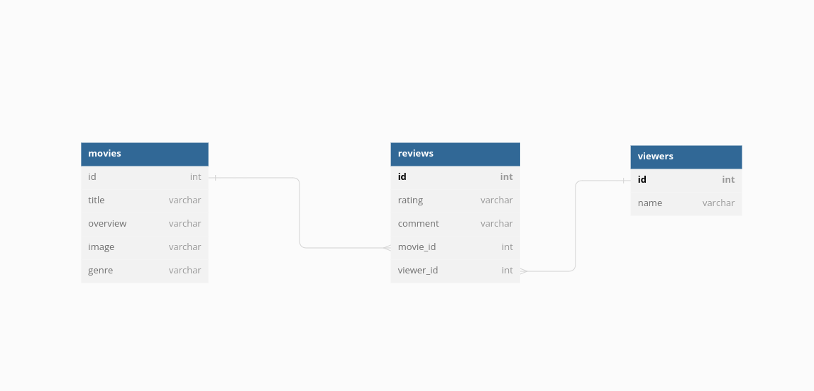

# Rateflix

## Author
- [Faith Kimani](https://github.com/wanjikuKim-collab)

## Introduction
My application is a simple movie review app. You can Create a new review, view(Read) a list of all reviews on a given movie/series, edit(Update) an already existing movie and finally delete a review. This was based of my phase 2 React Netflix clone which, as the name suggests was a Netflix clone. To build on this concept, I wanted to add a Netflix review application where viewers are able to give feedback on movies and shows watched. 

This project is separated into two applications:

- A React frontend, in the `frontend` directory
- A Sinatra backend, in the `backend` directory


The focus of this project is **building a Sinatra API backend** that uses
**Active Record** to access and persist data in a database, which will be used
by a separate **React frontend** that interacts with the database via the API.

## Technology

* Ruby
* Sinatra
* Active Record
* CSS
* HTML
* React

### Deployment

- The frontend component is found here: [Netflix Clone frontend ](https://rateflix-e0ab0.web.app/).

- The backend component ().

## Setup/Installation Requirements (for local development)
##### Backend
1. Download the zip file under the 'Code' tab.
2. Extract files from the zip file.
3. Open the extracted folder with VS Code.
4.To access the backend, `cd` into the `backend` directory
5. To install the required gems, run:
```console
bundle install
```
6. In your VS Code terminal to migrate the database and to seed data into the database from the [seeds.rb file](db/seeds.rb), run:
```console
bundle exec db:migrate db:seed
```
7. In your VS Code terminal to execute run the server, run:
```console
bundle exec rake server
```
8. And then, you are good to go. <br> For testing, use the VS Code terminal and the seed (test) data provided while in pry mode.To access pry open a new terminal, cd into backend and run:
```console
rake console
```
#####Frontend Setup
To get started, `cd` into the `frontend` directory. Then run:

```console
$ npm install
```

This will install the React project dependencies. Next, run this in a new terminal:

```console
$ npm start
```
Then visit [http://localhost:3000](http://localhost:3000) in the browser and
interact with the application to get a sense of its features.


<!--## Important Commands
### 1. Running the Server
To run the server, run: 
```sh

```

To simply run the server, run:
```sh
npm start
```

### 2. Resetting/Seeding the Data
To copy data from the `./db/seeds.json` file to the `./db/db.json` file, run:
```sh
npm run seed
```
This will reset the database back to the original data. -->

## Bugs
There are no bugs. Please report any new bugs encountered.

### Requirements
The following have to be met for this project:

- Use Active Record to interact with a database.
- Have at least two models with a one-to-many relationship.
- At a minimum, set up the following API routes in Sinatra:
  - create and read actions for both models
  - full CRUD capability for one of the models: 
  The update action should be implemented using a form that is 
  pre-filled with existing values for the object. On submission of 
  the form, the object should update. Note: Using a like button or 
  similar will not meet the update requirement.
- Build a separate React frontend application that interacts with the API to
  perform CRUD actions.
- Implement proper front end state management. You should be updating state using a
  setState function after receiving your response from a POST, PATCH, or DELETE 
  request. You should NOT be relying on a GET request to update state. 
- Use good OO design patterns. You should have separate classes for each of your
  models, and create instance and class methods as necessary. 
- Routes in your application (both client side and back end) should follow RESTful
  conventions.
- Use your back end optimally. Pass JSON for related associations to the front 
  end from the back end. You should use active record methods in your controller to grab
  the needed data from your database and provide as JSON to the front end. You
  should NOT be relying on filtering front end state or a separate fetch request to
  retrieve related data.

## Getting Started

### Backend 

First I setup my backend which had the following file structure:
 
* app/models: Our Active Record models. Responsible for code that accesses and updates data in our   database using classes that inherit from ActiveRecord::Base.
* config: Code in this folder is responsible for our environment setup, like requiring files/gems, and establishing a connection to the database.
* db/migrate: Our Active Record migrations. Responsible for creating and altering the structure of the database (making new tables, adding columns to existing tables, etc).
* db/seed.rb: Lets us easily add sample data to the database.
spec: Our RSpec tests.
* Gemfile: Lists all the gems our application depends on.
* Rakefile: Code for common tasks that we can easily run from the command line, like rake console.

After which I ran `bundle install` to install the gems.

To start the server run:

```console
$ bundle exec rake server
```

This will run the server on port
[http://localhost:9292](http://localhost:9292).

#### Migrations and Model
So for the backend, I have a movies table, viewers table and a reviews table. You can Create a new review, view (Read) a list of reviews on a movie/series, edit (Update) an already existing review and Delete a review.
 The reviews table has a one-to-many relationship with both the movies and viewers tables, where a review belongs to a viewer and a review also belongs to a movie. It has columns for the `viewer_id` and `movie_id` hence it acts as the single source of truth for the application. The movies and viewers tables have a many-to-many relationship.

 I used Active Record to create my migrations which are displayed in the schema. 
Note:Here is my domain/Entity Relationship Diagram(ERD) using dbdiagram.io
https://dbdiagram.io/d/63fd8f6e296d97641d8433de


After setting up my models and relationships, I made some seed data to test out my data so as to ensure my relationships were working properly.

```rb
puts "🌱 Seeding spices..."

# Seed your database here
Movie.create(title: "Alice in Boderland", overview: "Alice in Borderland stars Kento Yamazaki as young unemployed gamer Ryohei Arisu, whose life changes drastically when he is mysteriously transported to a parallel universe in which he is forced to play a series of twisted games in order to remain alive. There's no telling who, exactly, is behind these games — Aliens", image: "https://dnm.nflximg.net/api/v6/BvVbc2Wxr2w6QuoANoSpJKEIWjQ/AAAAQT-N5q5ZH-s7BmNbaq8drcFA6FvuQExH5jjla9x0gVrUWXgKV2SgYMNodXqu5OAhnRWGJjJWSrCY1qKk5UJVMFZwUj5gGKGe-8kVYaSYsri5GxZuCH8Epo_Nv0R7Qj89UJXxEOM6y902Fz0PSqBqNl_zP8I.jpg?r=b3a", genre: "Thriller")
Review.create(ratings: 4.7, comment: "The whole show keeps me stuck in my seat. I really liked the games and the interaction between the players.", viewer_id: 1, movie_id: 1)
Viewer.create(name: "Patricia Sibaja")

puts "✅ Done seeding!

```

### Entity Relationship Diagram
https://dbdiagram.io/d/63fd8f6e296d97641d8433de

#### Setting up the necessary routes to handle requests
To handle the necessary CRUD operations I built out the following routes:

### Frontend Setup

I placed my backend and frontend in **two different repositories**.

I created a new repository in a **separate folder** with a React app for my
frontend. I used[create-react-app][] to generate the necessary code for your React frontend:

```console
$ npx create-react-app my-app-frontend
```
 I went on and created the various components and pages.

After creating the project locally, I went on and created a Github repo
[create a repository on GitHub][create repo] to host my repo.

## VIDEO PREVIEW
[

### IN PROGRESS
I'm currently working on the signup and sign in pages


### Support/ Contact Details:
- wanjikukimani24@gmail.com
- (+254) 0797493262

### License
Copyright 2023 Faith Kimani

Licensed under the Apache License, Version 2.0 (the "License");
you may not use this file except in compliance with the License.
You may obtain a copy of the License at

    http://www.apache.org/licenses/LICENSE-2.0

Unless required by applicable law or agreed to in writing, software
distributed under the License is distributed on an "AS IS" BASIS,
WITHOUT WARRANTIES OR CONDITIONS OF ANY KIND, either express or implied.
See the License for the specific language governing permissions and
limitations under the License.

